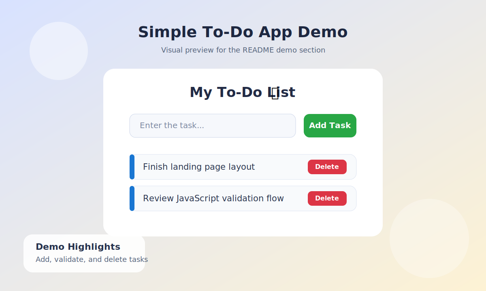
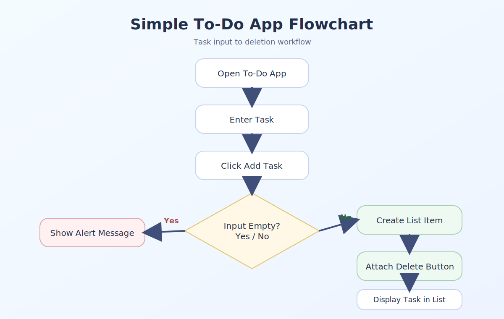
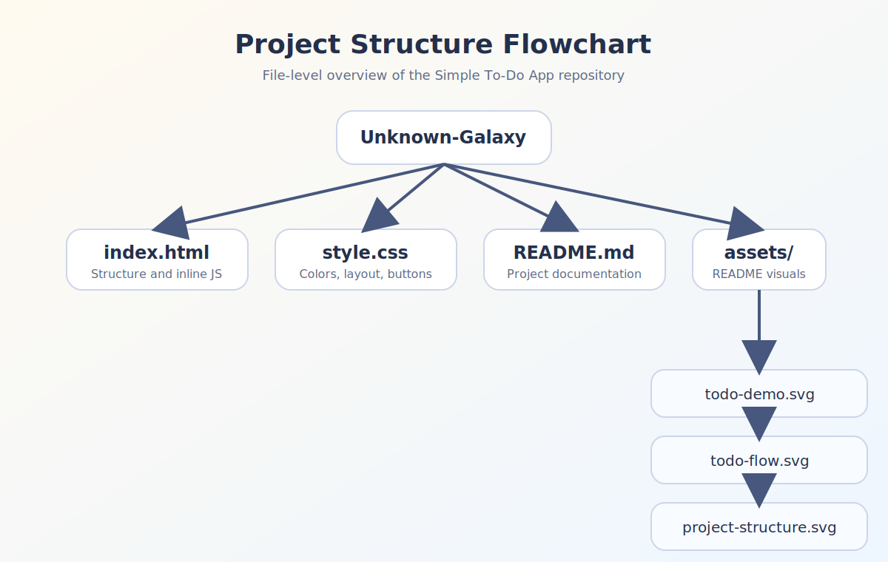
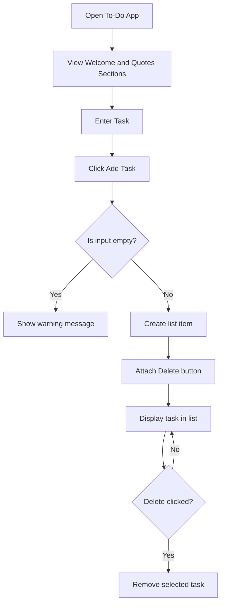
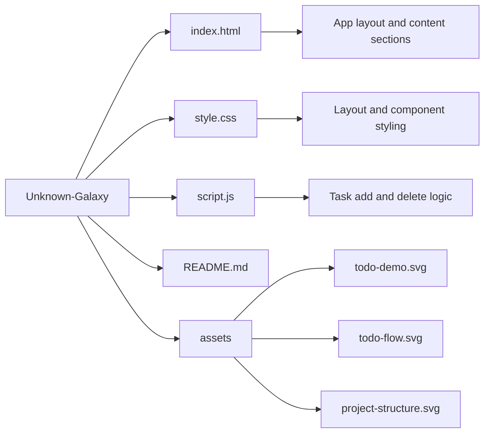

# To-Do App

A clean and beginner-friendly to-do list application built with `HTML`, `CSS`, and `vanilla JavaScript`.

This project focuses on front-end fundamentals like handling user input, updating the DOM dynamically, and keeping the interface simple, visual, and easy to understand.

**Author:** Aayush Sharma

## Pictorial Demo



## Demo Images





## Overview

The app allows users to add tasks to a live list and remove them instantly when they are no longer needed. It also includes basic validation so empty tasks are not added by mistake.

The current UI also includes:

- A welcome section
- A motivational quotes section
- A live warning message for empty input
- A separate `script.js` file for JavaScript logic

Because everything runs on the client side, the project is lightweight, fast to open, and easy to deploy on any static hosting platform.

## Features

- Add new tasks with a single click
- Remove tasks using a dedicated delete button
- Show a warning message when the input is empty
- Simple colorful UI with gradient styling
- Welcome and motivational quotes sections
- No frameworks, build tools, or external libraries required

## Tech Stack

- `HTML5` for structure
- `CSS3` for styling and layout
- `JavaScript` for DOM interaction and task management

## Project Structure

| File | Purpose |
| --- | --- |
| `index.html` | Main structure of the app including content sections |
| `style.css` | Styling, layout, colors, and button design |
| `script.js` | Task creation, validation, and delete logic |
| `README.md` | Project documentation |
| `assets/` | README demo images and flowchart visuals |

## How It Works

1. The user opens the app and sees the welcome section, to-do area, and motivational quotes.
2. The user enters a task in the input field.
3. Clicking `Add Task` runs the JavaScript logic from `script.js`.
4. If the input is empty, a warning message appears briefly.
5. If the input contains text, a new list item is created dynamically.
6. A `Delete` button is attached to the new task.
7. The task is displayed in the list.
8. Clicking `Delete` removes the selected task from the UI.

## Flowchart Explanation

1. Start from the app screen.
2. Enter a task and click `Add Task`.
3. The program checks whether the input field is empty.
4. If it is empty, a warning message is shown in the interface.
5. If it is not empty, a task item is created.
6. A delete button is added to that task.
7. The task appears in the to-do list.
8. When the delete button is clicked, the task is removed.

## App Flowchart



## Project Structure Flowchart



## Folder Structure

```text
Unknown-Galaxy/
|-- index.html
|-- style.css
|-- script.js
|-- README.md
`-- assets/
    |-- project-structure.svg
    |-- todo-demo.svg
    `-- todo-flow.svg
```

## Run Locally

1. Clone or download this repository.
2. Open `index.html` directly in your browser.

No installation or build process is required.

## Deployment

Since this is a static front-end project, it can be deployed on any platform that serves plain `HTML`, `CSS`, and `JavaScript`.

### GitHub Pages

1. Push the project to a GitHub repository.
2. Open the repository on GitHub.
3. Go to `Settings` > `Pages`.
4. Choose `Deploy from a branch`.
5. Select the `main` branch and `/ (root)` folder.
6. Save and wait for the live site URL.

### Netlify

1. Import the GitHub repository into Netlify.
2. Leave the build command empty.
3. Use `.` as the publish directory if asked.
4. Click `Deploy site`.

### Vercel

1. Import the GitHub repository into Vercel.
2. Keep the default settings for a static site.
3. Click `Deploy`.

## Use Cases

- Practicing DOM manipulation
- Learning event handling in JavaScript
- Building a starter portfolio project
- Understanding how small client-side apps are structured

## Current Limitations

- Tasks are not saved after page refresh
- Users cannot edit or mark tasks as completed yet
- Empty input feedback disappears after a short time

## Suggested Improvements

- Add `localStorage` support for task persistence
- Allow tasks to be marked as completed
- Add edit and filter functionality
- Improve mobile responsiveness further
- Replace encoded emoji text with clean UTF-8 characters
