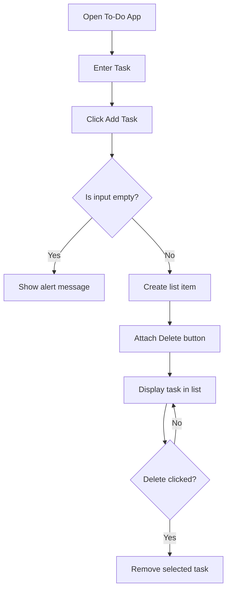
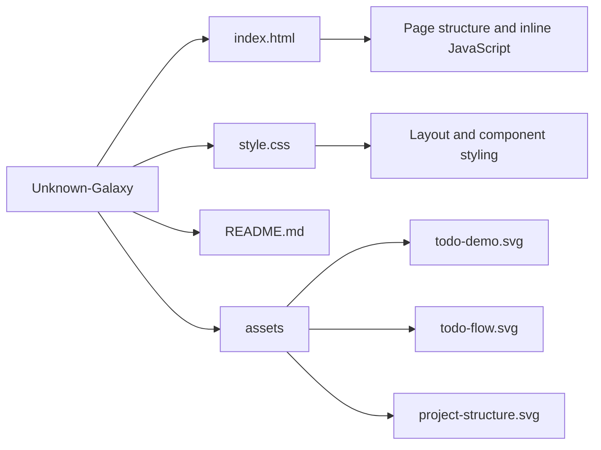

# Simple To-Do App

A lightweight To-Do application built with HTML, CSS, and JavaScript. It lets users add tasks quickly, prevents empty submissions, and removes tasks with a single click.

**Author:** Aayush Sharma

## Pictorial Demo


## Demo Images


## Features

- Add tasks instantly from the input box
- Show an alert when the input field is empty
- Delete any task using its dedicated button
- Simple centered layout with clean styling

## Flowchart Explanation

1. The user opens the app and enters a task in the input field.
2. After clicking `Add Task`, the script checks whether the input is empty.
3. If the field is empty, the app shows an alert message.
4. If the field has text, a new list item is created.
5. A `Delete` button is attached to that item.
6. The task appears in the list.
7. When the `Delete` button is clicked, that task is removed from the UI.

## App Flowchart



## Project Structure Flowchart



## Folder Structure

```text
Unknown-Galaxy/
|-- index.html
|-- style.css
|-- README.md
`-- assets/
    |-- project-structure.svg
    |-- todo-demo.svg
    `-- todo-flow.svg
```

## Tech Stack

- HTML5
- CSS3
- Vanilla JavaScript

## Run the Project

Open `index.html` in any modern browser.
